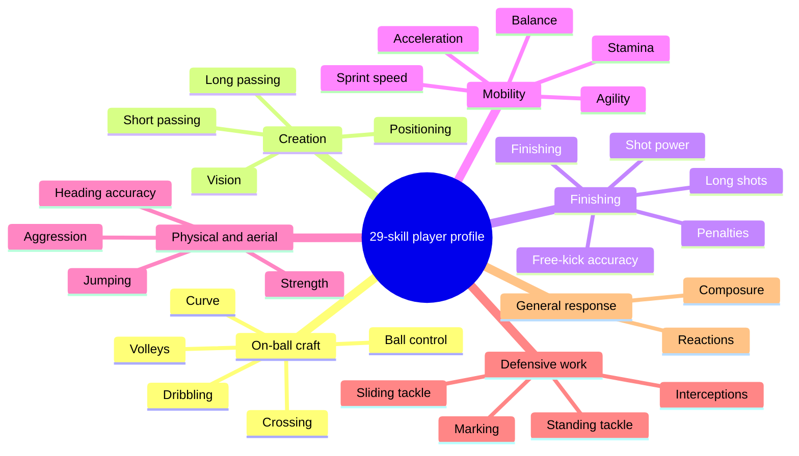

# The Beautiful Game, Reduced

<div align="center">

### PCA, sparse PCA, and a from-scratch penalized matrix decomposition of Eredivisie player skills

[](https://www.r-project.org/)
[](#data-provenance-and-contract)
[](#the-scouting-space)
[](#what-the-two-dimensional-map-retains)
[](#sparse-pca-an-interpretable-team-sheet)
[](#manual-pmd-an-algorithmic-replay)
[](renv.lock)
[](LICENSE)

**[Read the final report](report/the-beautiful-game-reduced.pdf)** · **[Run PCA and SPCA](src/01_pca_spca.R)** · **[Inspect the manual PMD](src/02_manual_pmd.R)** · **[Check the data contract](data/README.md)**

Original academic project title: **The Beautiful Game, Reduced**

</div>

A FIFA player card is a high-dimensional object disguised as a compact graphic. Ball control overlaps with dribbling, marking overlaps with tackling, and acceleration overlaps with sprint speed. This project asks what remains when those 29 correlated ratings are compressed into a small number of statistically coherent football profiles.

The study has three layers. Principal component analysis discovers the dominant geometry of the standardized skill space. Sparse PCA turns dense directions into short, legible lists of decisive attributes. A separate implementation of penalized matrix decomposition then rebuilds the sparse-factor algorithm—soft thresholding, constrained normalization, alternating updates, sign alignment, and deflation—and checks it against `PMA::PMD`.

<table>
  <tr>
    <td align="center"><strong>488</strong><br><sub>players in the skill-only matrix</sub></td>
    <td align="center"><strong>448</strong><br><sub>complete cases for the contextual overlays</sub></td>
    <td align="center"><strong>71.5%</strong><br><sub>standardized variance retained by PC1 and PC2</sub></td>
    <td align="center"><strong>0.00212653</strong><br><sub>largest manual-versus-package loading gap</sub></td>
  </tr>
</table>

The repository is a lean information hub. The [report](report/the-beautiful-game-reduced.pdf) is the complete evidence package; the curated programs expose the executable research logic; and the [data contract](data/README.md) makes the one non-redistributable input explicit.

## Contents

- [The scouting question](#the-scouting-question)
- [The scouting space](#the-scouting-space)
- [Data provenance and contract](#data-provenance-and-contract)
- [PCA: the geometry of a player profile](#pca-the-geometry-of-a-player-profile)
- [Sparse PCA: an interpretable team sheet](#sparse-pca-an-interpretable-team-sheet)
- [Manual PMD: an algorithmic replay](#manual-pmd-an-algorithmic-replay)
- [Experimental design](#experimental-design)
- [Results](#results)
- [Artifact map](#artifact-map)
- [Reproduce the analysis](#reproduce-the-analysis)
- [Limits of the evidence](#limits-of-the-evidence)
- [Method and data references](#method-and-data-references)
- [License](#license)

## The scouting question

The central question is:

> Which latent skill dimensions summarize Eredivisie player profiles, and how do those dimensions align with playing roles and contemporaneous market-value tiers?

That breaks into four testable questions:

1. How much standardized skill variation can two orthogonal directions retain?
2. Which attributes dominate those directions, and can sparsity make the interpretation more stable and concise?
3. Do goalkeepers, defenders, midfielders, and forwards occupy different regions of the learned score space?
4. Can an independently coded penalized matrix decomposition reproduce the package implementation to a tight numerical tolerance?

Position and economic variables are **interpretive overlays**. They do not enter the PCA or SPCA fit. The project is therefore an unsupervised, descriptive analysis—not a predictor of market value and not a causal model of player performance.

## The scouting space

The 29 ratings form a vocabulary of football ability rather than 29 independent concepts. This map shows the feature families the decompositions must untangle:



Three statistical roles sit behind that football vocabulary:

<table>
  <tr>
    <th align="left">PCA: read the shape</th>
    <th align="left">SPCA: name the shape</th>
    <th align="left">Manual PMD: verify the machinery</th>
  </tr>
  <tr>
    <td>Find orthogonal directions with maximal variance and quantify information retained.</td>
    <td>Concentrate each loading vector on a small subset of skills through an ℓ1 constraint.</td>
    <td>Recreate constrained rank-one factors and compare them with the established implementation.</td>
  </tr>
</table>

## Data provenance and contract

The supplied course object contains **488 FIFA 17 players from 18 Eredivisie clubs**, 29 integer-valued skill ratings, a broad position, and three euro-denominated economic variables. The full object has 35 columns.

| Analysis view | Rows | Why |
|---|---:|---|
| PCA and SPCA | 448 | Complete skills, position, value, wage, and release-clause fields are required for a consistent score-and-overlay cohort. |
| Manual PMD | 488 | The factorization uses only the 29 complete skill columns. |

The original `FIFA2017_NL.RData` is not committed. It arrived without a traceable creator record or redistribution licence. Similarity to public FIFA-derived datasets does not establish the provenance or legal terms of this exact extract. [`data/README.md`](data/README.md) records the filename, byte size, SHA-256 digest, serialized object name, ordered schema, storage types, missingness, and accepted local-path mechanisms.

The [official EA Sports FC ratings site](https://www.ea.com/games/ea-sports-fc/ratings) is useful context for the contemporary rating vocabulary, but it is **not claimed as the source of this historical course artifact**. That distinction is intentional: reproducibility requires an exact file identity, while redistribution requires independently established rights.

## PCA: the geometry of a player profile

### Standardization

Let `z_ij` denote player `i`'s observed rating for skill `j`. Each column is centered and scaled so that differently dispersed attributes enter the geometry comparably:

```math
x_{ij} = \frac{z_{ij}-\bar z_j}{s_j},
\qquad
X \in \mathbb{R}^{448 \times 29}.
```

The sample covariance matrix of the standardized design is

```math
S = \frac{1}{n-1}X^{\mathsf T}X.
```

### Eigenvectors, scores, and retained variation

PCA orders orthonormal loading vectors by the variance they capture:

```math
S\alpha_j = \lambda_j\alpha_j,
\qquad
\lambda_1 \geq \lambda_2 \geq \cdots \geq \lambda_{29} \geq 0.
```

For the first `r` components, the score matrix is

```math
T_r = XA_r,
\qquad
A_r = \begin{bmatrix}\alpha_1 & \cdots & \alpha_r\end{bmatrix}.
```

The proportion of variance explained by component `j` is

```math
\mathrm{PVE}_j = \frac{\lambda_j}{\sum_{\ell=1}^{29}\lambda_\ell}.
```

The implementation calls `prcomp(..., center = TRUE, scale. = TRUE)`, which uses a singular-value decomposition of the centered and scaled matrix. This is numerically preferable to explicitly forming and diagonalizing the covariance matrix.

PCA signs are unidentified. Multiplying a loading vector and its associated score column by `-1` leaves the fitted subspace unchanged. The football interpretation therefore rests on relative score position, loading magnitude, and groups of co-moving skills—not on an intrinsically positive axis direction.

## Sparse PCA: an interpretable team sheet

Dense PCA distributes nonzero weight across nearly every attribute. In the penalized-matrix-decomposition formulation used by `PMA::SPC`, a sparse rank-one direction solves the constrained problem

```math
\max_{u,v} \; u^{\mathsf T}Xv
\quad \text{subject to} \quad
\lVert u \rVert_2 \leq 1,
\quad
\lVert v \rVert_2 \leq 1,
\quad
\lVert v \rVert_1 \leq c.
```

The ℓ2 constraints control scale. The ℓ1 budget `c`, exposed through `sumabs`, controls loading sparsity: a smaller budget zeros more coefficients, while a larger budget approaches a denser PCA-like direction.

The experiment estimates two sparse components at `sumabs = 2.0` and then repeats the complete loading-and-score analysis at `1.5` and `2.5`.

| Setting | Sparse component 1 | Sparse component 2 | Interpretive role |
|---:|---|---|---|
| `1.5` | 3 active skills | 3 active skills | Deliberately severe compression |
| `2.0` | Ball control, dribbling, short passing, positioning, crossing | Standing tackle, marking, sliding tackle, interceptions | Main specification |
| `2.5` | Denser technical bundle | Denser defensive bundle including aggression | Robustness toward ordinary PCA |

The sparse solutions are useful because they preserve the substantive two-axis story while dramatically reducing the number of attributes needed to name it.

## Manual PMD: an algorithmic replay

The second program does not merely call another model. It implements the mechanics behind sparse penalized matrix decomposition and compares the result with `PMA::PMD` on the same centered, unscaled 488-by-29 skill matrix.

### Soft thresholding

For scalar or vector input `x`, the soft-thresholding map is

```math
\mathcal{S}(x,\lambda)
=
\mathrm{sign}(x)\bigl(|x|-\lambda\bigr)_+.
```

The nonzero result is normalized to unit Euclidean length:

```math
\widetilde{x}(\lambda)
=
\frac{\mathcal{S}(x,\lambda)}{\lVert \mathcal{S}(x,\lambda) \rVert_2}.
```

A binary search chooses the threshold that satisfies the requested ℓ1 target. With `v` fixed, the program updates `u` from `Xv`; with `u` fixed, it updates `v` from the transposed multiplication:

```math
\begin{aligned}
u^{(t+1)} &= \widetilde{Xv^{(t)}}(\lambda_u), \\
v^{(t+1)} &= \widetilde{X^{\mathsf T}u^{(t+1)}}(\lambda_v), \\
d &= u^{\mathsf T}Xv.
\end{aligned}
```

Convergence is assessed from the loading-vector change, up to the factor's arbitrary sign. Once a factor is accepted, rank-one deflation produces the residual matrix for the next factor:

```math
X^{(k+1)} = X^{(k)} - d_k u_k v_k^{\mathsf T}.
```

The implementation extracts five factors with `sumabsu = sqrt(n)`, `sumabsv = 3`, at most 100 iterations per factor, and tolerance `1e-6`. It aligns signs before comparing package and manual solutions. This isolates algorithmic agreement from the irrelevant sign ambiguity.

> [!NOTE]
> The PMD check is strongest as a **verification experiment**: the same constraints and input matrix are solved through independently expressed code, then compared at both loading and singular-value level.

## Experimental design

| Stage | Statistical operation | Diagnostic or output |
|---:|---|---|
| 1 | Select the 29 bounded skill fields and preserve economic variables only for interpretation | Schema and complete-case checks |
| 2 | Standardize each skill | Comparable column geometry |
| 3 | Fit dense PCA | Scree profile, PVE, biplot, score maps, loading tables |
| 4 | Overlay broad position and market-value quartile | Role separation and contextual gradient |
| 5 | Fit two-component SPCA at `sumabs = 2.0` | Sparse scores and active loadings |
| 6 | Repeat SPCA at `1.5` and `2.5` | Sensitivity of interpretation to sparsity |
| 7 | Fit five manual PMD factors and the package benchmark | Loading and singular-value discrepancies |

The report contains the complete plot suite and tabular output. The public repository keeps those results canonical in one place rather than duplicating a figure gallery that could drift away from the analysis.

## Results

### What the two-dimensional map retains

| Quantity | Exact result |
|---|---:|
| PC1 variance explained | 55.3% |
| PC2 variance explained | 16.2% |
| Cumulative PC1–PC2 variance | **71.5%** |
| Correlation between PC1 and `log(1 + eur_value)` | -0.491 |

The sign of the market-value correlation follows the arbitrary orientation of PC1; its magnitude is the meaningful diagnostic. The score map shows the main value gradient along the broad technical first direction, while the second direction more clearly differentiates playing roles.

### Dense and sparse loading vocabularies

| Direction | Largest absolute loadings |
|---|---|
| Dense PC1 | Ball control -0.24; dribbling -0.23; short passing -0.23; crossing -0.22; positioning -0.22 |
| Dense PC2 | Marking -0.37; sliding tackle -0.36; standing tackle -0.36; interceptions -0.35; aggression -0.28 |
| Sparse PC1 | Ball control -0.65; dribbling -0.60; short passing -0.38; positioning -0.21; crossing -0.16 |
| Sparse PC2 | Standing tackle -0.53; marking -0.52; sliding tackle -0.51; interceptions -0.44; aggression rounds to -0.00 |

Goalkeepers are distinct along the first score direction. Among outfield players, defenders and attackers separate most clearly along the defensive second direction, while midfielders generally occupy the intermediate region. The qualitative structure survives both stronger and weaker sparsity constraints.

### Five-factor PMD replay

| Factor | Package singular value | Manual singular value | Football interpretation |
|---:|---:|---:|---|
| 1 | 1163.77 | 1163.77 | Attacking technique and finishing |
| 2 | 1110.46 | 1110.45 | Defensive actions |
| 3 | 753.62 | 753.58 | Pace and agility |
| 4 | 455.33 | 455.25 | Aerial and physical presence |
| 5 | 397.97 | 397.88 | Set pieces and playmaking contrasted with pace |

| Verification diagnostic | Exact result |
|---|---:|
| Maximum absolute loading difference | **0.00212653** |
| Maximum absolute singular-value difference | **0.0969197** |

The independent reconstruction therefore recovers the same sparse factor geometry and nearly identical factor magnitudes. That is the project's key computational result.

## Artifact map

| Question | Canonical location |
|---|---|
| Data definition and preprocessing | Report section 2, [physical PDF page 2](report/the-beautiful-game-reduced.pdf#page=2) |
| PCA and SPCA mathematics | Report section 3, [physical PDF page 3](report/the-beautiful-game-reduced.pdf#page=3) |
| PCA and SPCA results | Report section 4, [physical PDF page 4](report/the-beautiful-game-reduced.pdf#page=4) |
| Robustness and conclusion | Report sections 4–5, [physical PDF page 7](report/the-beautiful-game-reduced.pdf#page=7) |
| Manual PMD derivation and results | Exercise 7.2, [physical PDF page 18](report/the-beautiful-game-reduced.pdf#page=18) |
| Executable PCA and SPCA | [`src/01_pca_spca.R`](src/01_pca_spca.R) |
| Executable manual PMD | [`src/02_manual_pmd.R`](src/02_manual_pmd.R) |
| Exact private-input interface | [`data/README.md`](data/README.md) |
| Locked package state | [`renv.lock`](renv.lock) |
| Citation metadata | [`CITATION.cff`](CITATION.cff) |

The PDF cover is physical page 1; printed report pagination begins on physical page 2. The public R programs preserve the research logic while removing runtime package installation, working-directory assumptions, a machine-specific font dependency, and a deprecated plotting argument.

## Reproduce the analysis

### 1. Clone and restore the locked environment

```bash
git clone https://github.com/SadraDaneshvar/the-beautiful-game-reduced-fifa-pca-spca.git
cd the-beautiful-game-reduced-fifa-pca-spca
make setup
```

`make setup` restores the package versions recorded under R 4.5.1 in [`renv.lock`](renv.lock). Package installation occurs only in this explicit setup target; the analysis programs do not mutate the user's library.

### 2. Supply an authorized copy of the exact dataset

Place the file at the ignored path `data/FIFA2017_NL.RData`, or point to it outside the repository:

```bash
export FIFA2017_NL_PATH="/path/to/FIFA2017_NL.RData"
make verify-data
```

The required SHA-256 digest is `a56a3065dba053436d0302cbf08a854c94d9c4cdeccdf3a7bf68daa99fdac540`. Verification checks both the binary identity and the serialized R object contract.

### 3. Run all analyses

```bash
make run
```

Or run one branch:

```bash
make pca
make pmd
```

Generated PCA/SPCA outputs go to `results/pca_spca/`; PMD comparisons go to `results/manual_pmd/`. Both directories are ignored by Git. A dataset-free integrity check is also available:

```bash
make validate
```

It parses both R programs, verifies the canonical report checksum, and confirms that a local data copy cannot be accidentally tracked.

## Limits of the evidence

- **The exact data artifact cannot be redistributed responsibly.** A fresh clone requires an authorized local copy matching the documented checksum and schema.
- **The ratings are constructed measurements.** They encode a game publisher's assessment framework, not direct event-level football performance.
- **The design is descriptive.** Latent scores summarize covariation and do not identify causal effects on role, wage, or market value.
- **The economic overlay is not a transfer-price model.** Contemporaneous value fields contextualize the score space but are not outcomes in a validated predictive design.
- **One league and one historical season limit external validity.** Skill bundles may change across leagues, seasons, rating systems, and player populations.
- **Complete-case filtering changes the contextual cohort.** Forty players lack release-clause values, so PCA/SPCA use 448 records even though the 29 skill fields are complete for all 488.
- **Goalkeepers have structurally different profiles.** Their separation is substantively useful, but it also motivates a future outfield-only or position-stratified replication.
- **Sparsity is selected for interpretation.** The `sumabs` grid demonstrates qualitative stability; it is not a cross-validated predictive hyperparameter search.
- **Deflation is sequential.** Later PMD factors inherit approximation error and depend on the earlier extracted directions.
- **Software lockfiles reduce rather than eliminate drift.** Compiled libraries and graphics devices may still produce small platform-specific differences.
- **The final PDF is canonical.** Editable LaTeX and bibliography sources were not present in the original project folder.

## Method and data references

- I. T. Jolliffe and J. Cadima, [“Principal component analysis: a review and recent developments”](https://doi.org/10.1098/rsta.2015.0202), *Philosophical Transactions of the Royal Society A*, 2016.
- The R Project, [`stats::prcomp` reference manual](https://stat.ethz.ch/R-manual/R-devel/library/stats/html/prcomp.html), documenting the SVD-based implementation used here.
- D. M. Witten, R. Tibshirani, and T. Hastie, [“A penalized matrix decomposition, with applications to sparse principal components and canonical correlation analysis”](https://doi.org/10.1093/biostatistics/kxp008), *Biostatistics*, 2009.
- CRAN, [`PMA`: Penalized Multivariate Analysis](https://CRAN.R-project.org/package=PMA), the authoritative package record for the benchmark SPCA and PMD implementation.
- EA Sports, [official FC player-ratings portal](https://www.ea.com/games/ea-sports-fc/ratings), linked only as current first-party context for the rating vocabulary—not as provenance for the undistributed FIFA 17 course file.

The final report contains the complete project bibliography and methodological discussion.

## License

Code and repository documentation are released under the [MIT License](LICENSE). Machine-readable citation metadata is available in [`CITATION.cff`](CITATION.cff).

The FIFA-derived dataset is not covered by this repository's licence and is not distributed here. FIFA and EA Sports are trademarks of their respective owners; this independent academic project is not affiliated with or endorsed by them.
