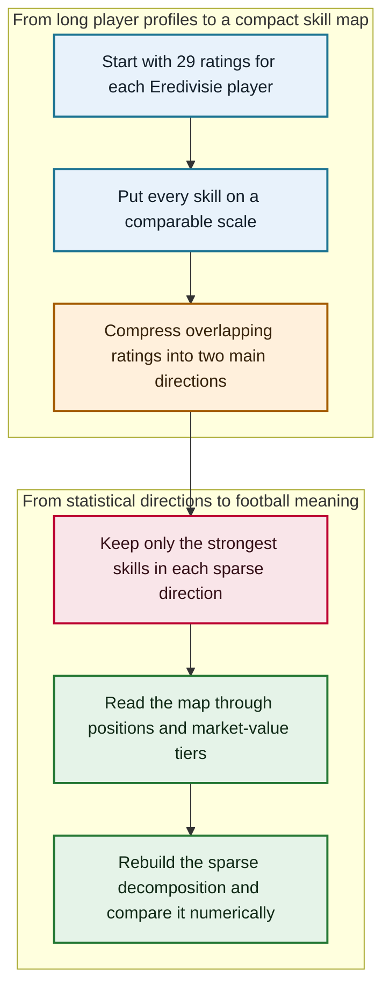

# The Beautiful Game, Reduced: PCA, Sparse PCA, and Penalized Matrix Decomposition of Eredivisie Player Skills

<div align="center">

**A rigorous dimension-reduction study of how 29 football attributes collapse into interpretable technical, defensive, physical, and playmaking profiles**

[](https://www.r-project.org/)
[](#dataset-and-feature-space)
[](#sparse-pca)
[](#manual-penalized-matrix-decomposition)
[](LICENSE)

**[Read the report](report/the-beautiful-game-reduced.pdf)** · **[Inspect PCA and SPCA](src/01_pca_spca.R)** · **[Inspect the manual PMD](src/02_manual_pmd.R)** · **[Review the data contract](data/README.md)**

Original academic project title: **The Beautiful Game, Reduced**

</div>

Football scouting data can describe a player through dozens of overlapping ratings, but a long attribute sheet does not immediately reveal the few broad capabilities that distinguish roles. This project turns that high-dimensional profile into a compact statistical map. Principal component analysis identifies the dominant directions of variation; sparse PCA makes those directions easier to name; and an independently implemented penalized matrix decomposition checks the computational machinery behind the sparse solution.

The result is an end-to-end study of representation, interpretation, and verification. It connects matrix geometry to recognizable football profiles, then asks how those profiles align with playing position and contemporaneous market-value tiers. The [final report](report/the-beautiful-game-reduced.pdf) remains the complete evidence package, including the original figures, tables, references, appendices, and assignment response.

## Contents

- [Project at a glance](#project-at-a-glance)
- [Research questions](#research-questions)
- [Project pipeline](#project-pipeline)
- [Dataset and feature space](#dataset-and-feature-space)
- [Standardization and PCA geometry](#standardization-and-pca-geometry)
- [Sparse PCA](#sparse-pca)
- [Manual penalized matrix decomposition](#manual-penalized-matrix-decomposition)
- [Experimental design](#experimental-design)
- [Key findings](#key-findings)
- [Where to explore the project](#where-to-explore-the-project)
- [Run locally](#run-locally)
- [Reproducibility and limitations](#reproducibility-and-limitations)
- [License](#license)

## Project at a glance

| Dimension | Project design |
|---|---|
| Domain | Professional football player profiles in the Dutch Eredivisie |
| Raw cohort | 488 players across 18 clubs |
| Main analysis cohort | 448 complete cases for skills, position, and economic overlays |
| Feature space | 29 skill ratings on a common 0–100 scale |
| Context variables | Primary position, market value, wage, and release clause |
| Dimension reduction | PCA on standardized skills and two-component sparse PCA |
| Sparsity design | Baseline `sumabs = 2.0`; robustness at `1.5` and `2.5` |
| Verification | Manual five-factor PMD compared with `PMA::PMD` |
| Reproducibility seed | 1363 |
| Stack | R, dplyr, tidyr, ggplot2, PMA, xtable, scales, ggrepel |
| Main artifacts | Final report, two curated R programs, data contract, and locked environment |

The two analysis programs answer complementary questions. [`01_pca_spca.R`](src/01_pca_spca.R) studies the interpretable two-dimensional representation. [`02_manual_pmd.R`](src/02_manual_pmd.R) reconstructs the sparse matrix-decomposition algorithm and checks it numerically against the package implementation.

## Research questions

The central question is: **which latent skill dimensions summarize Eredivisie player profiles, and how do those dimensions align with playing roles and market value?**

That question divides naturally into three parts:

1. How much of the standardized skill variation can a small number of orthogonal components retain?
2. Can sparse loadings recover the same football structure with fewer active skills and clearer labels?
3. Does a manual soft-thresholding and deflation algorithm reproduce the established PMD implementation?

The position and value variables are used to interpret the learned score space; they do not enter the PCA or SPCA fit. The analysis is therefore descriptive rather than predictive or causal.

## Project pipeline



The pipeline deliberately separates representation from interpretation. Skills determine the latent axes; position and market-value quartiles are overlaid only after the axes have been estimated. The manual decomposition then provides a separate algorithmic check rather than another interpretation layer.

## Dataset and feature space

The course-provided object contains 488 FIFA 17 players from the Eredivisie. Each record has a player name, club, broad position, 29 on-field skill ratings, and three euro-denominated economic variables. The skills cover five broad families:

| Family | Representative variables |
|---|---|
| Technique | Ball control, dribbling, crossing, curve, volleys |
| Passing and creation | Short passing, long passing, vision, positioning |
| Finishing and set pieces | Finishing, long shots, shot power, penalties, free-kick accuracy |
| Mobility and physicality | Acceleration, sprint speed, agility, balance, stamina, strength, jumping |
| Defending | Marking, standing tackle, sliding tackle, interceptions, aggression |

The PCA/SPCA program requires complete observations across the skill variables and interpretation covariates, leaving 448 players. The manual PMD program uses all 488 players because all 29 skill columns are complete and the economic fields are irrelevant to that calculation.

The original `FIFA2017_NL.RData` is intentionally not committed. It arrived as a course artifact without an authoritative source record or redistribution licence, and similarity to other public FIFA-derived datasets is not enough to establish that this exact extract inherits their terms. The precise object name, ordered schema, byte size, and SHA-256 checksum are documented in [`data/README.md`](data/README.md), together with the expected placement and environment variable.

## Standardization and PCA geometry

Let $z_{ij}$ be player $i$'s observed rating for skill $j$. PCA begins by standardizing every skill:

```math
x_{ij}
=
\frac{z_{ij}-\bar z_j}{s_j},
\qquad
X\in\mathbb{R}^{n\times p},
\qquad
n=448,
\quad
p=29.
```

The sample covariance matrix of the standardized skill matrix is

```math
S
=
\frac{1}{n-1}X^{\mathsf T}X.
```

PCA finds orthonormal loading vectors $\alpha_j$ satisfying

```math
S\alpha_j
=
\lambda_j\alpha_j,
\qquad
\lambda_1\geq\lambda_2\geq\cdots\geq\lambda_p\geq 0.
```

Player scores on the first $r$ directions are the projections

```math
T_r
=
XA_r,
\qquad
A_r
=
\begin{bmatrix}
\alpha_1 & \cdots & \alpha_r
\end{bmatrix}.
```

The proportion of standardized variation explained by component $j$ is

```math
\mathrm{PVE}_j
=
\frac{\lambda_j}{\sum_{\ell=1}^{p}\lambda_\ell}.
```

The implementation uses `prcomp(..., center = TRUE, scale. = TRUE)`, which computes the solution through singular value decomposition. Component signs are not identified: changing both a score direction and its loadings by $-1$ produces the same PCA solution. Interpretations therefore depend on loading magnitude and relative player position, not on an intrinsically positive or negative axis.

## Sparse PCA

Dense PCA loadings distribute weight across nearly every skill. Sparse PCA replaces that diffuse representation with a penalized rank-one approximation. In the PMD formulation underlying `PMA::SPC`, a component can be represented schematically as

```math
\max_{u,v}
\quad
u^{\mathsf T}Xv
\qquad
\text{subject to}
\qquad
\|u\|_2\leq 1,
\quad
\|v\|_2\leq 1,
\quad
\|v\|_1\leq c.
```

The $\ell_1$ bound $c$ is controlled by `sumabs`. Smaller values force more entries of $v$ to zero; larger values permit a denser approximation closer to ordinary PCA. The project estimates two sparse components at the baseline value `sumabs = 2.0`, then repeats the complete score and loading analysis at `1.5` and `2.5`.

At the baseline setting, sparse component 1 is concentrated on ball control, dribbling, short passing, positioning, and crossing. Sparse component 2 is concentrated on standing tackle, marking, sliding tackle, and interceptions. The sparse model therefore recovers the same technical-versus-defensive structure as PCA with a much smaller active vocabulary.

## Manual penalized matrix decomposition

The second program reconstructs the PMD update rather than treating sparse decomposition as a black box. For a vector $x$ and threshold $\lambda$, the soft-thresholding map is

```math
\mathcal{S}(x,\lambda)
=
\mathrm{sign}(x)
\left(|x|-\lambda\right)_+.
```

After thresholding, the update is normalized to unit Euclidean length:

```math
\widetilde{x}(\lambda)
=
\frac{\mathcal{S}(x,\lambda)}{\|\mathcal{S}(x,\lambda)\|_2}.
```

A binary search selects $\lambda$ so that the normalized vector meets the requested $\ell_1$ target. With $v$ fixed, the algorithm updates $u$ from $Xv$; with $u$ fixed, it updates $v$ from $X^{\mathsf T}u$:

```math
\begin{aligned}
u^{(t+1)}
&=
\widetilde{Xv^{(t)}}(\lambda_u),\\
v^{(t+1)}
&=
\widetilde{X^{\mathsf T}u^{(t+1)}}(\lambda_v),\\
d
&=
u^{\mathsf T}Xv.
\end{aligned}
```

After extracting one factor, its rank-one contribution is removed before fitting the next:

```math
X^{(k+1)}
=
X^{(k)}
-
d_k u_k v_k^{\mathsf T}.
```

The implementation extracts five factors from the centered, unscaled skill matrix with `sumabsu = sqrt(n)` and `sumabsv = 3`. Signs are aligned component by component before comparing the manual loadings with `PMA::PMD`.

> [!TIP]
> **The manual PMD is an executable verification, not merely a second model.** It independently implements threshold selection, alternating updates, sign alignment, and deflation, then tests whether those choices reproduce the established package output on the same matrix.

## Experimental design

The study proceeds through seven linked stages:

1. identify the 29 bounded skill variables and keep economic variables outside the learned representation;
2. form the complete-case cohort used for PCA/SPCA and standardize every skill;
3. fit PCA, calculate PVE, inspect loadings, and map player scores by position and value quartile;
4. fit two-component SPCA at the baseline sparsity constraint;
5. repeat SPCA at stronger and weaker sparsity levels to assess interpretive stability;
6. implement a five-factor PMD through soft thresholding, binary search, alternating updates, and deflation;
7. align component signs and compare manual loadings and singular values with `PMA::PMD`.

The report contains the generated score plots, biplot, scree plot, robustness panels, loading tables, and PMD comparison figure. They are not duplicated in Git; the curated scripts regenerate them under `results/`.

## Key findings

### PCA compression

| Quantity | Exact result |
|---|---:|
| PC1 variance explained | 55.3% |
| PC2 variance explained | 16.2% |
| Cumulative variance explained by PC1–PC2 | 71.5% |
| Correlation of PC1 with `log(1 + eur_value)` | -0.491 |

The market-value correlation sign follows the arbitrary orientation of PC1; its magnitude is the interpretable quantity. The score plots show the strongest value gradient along the technical first component, while the second component primarily separates playing roles.

### Dominant two-component loadings

| PCA component | Five largest absolute loadings |
|---|---|
| PC1 | Ball control -0.24; dribbling -0.23; short passing -0.23; crossing -0.22; positioning -0.22 |
| PC2 | Marking -0.37; sliding tackle -0.36; standing tackle -0.36; interceptions -0.35; aggression -0.28 |
| Sparse PC1 | Ball control -0.65; dribbling -0.60; short passing -0.38; positioning -0.21; crossing -0.16 |
| Sparse PC2 | Standing tackle -0.53; marking -0.52; sliding tackle -0.51; interceptions -0.44; aggression rounds to -0.00 |

Goalkeepers form a distinct cluster along the first direction. Among outfield players, defenders and attackers separate most clearly along the defensive second direction, with midfielders generally occupying the intermediate region. These patterns remain qualitatively stable when `sumabs` moves from `2.0` to `1.5` or `2.5`.

### Manual PMD agreement

| Diagnostic | Exact result |
|---|---:|
| Maximum absolute loading difference | 0.00212653 |
| Maximum absolute singular-value difference | 0.0969197 |

| Factor | Dominant interpretation | Leading skills |
|---|---|---|
| 1 | Attacking technique and finishing | Dribbling, long shots, curve, positioning, finishing |
| 2 | Defensive actions | Standing tackle, marking, sliding tackle, interceptions, aggression |
| 3 | Pace and agility | Acceleration, agility, sprint speed, balance, vision |
| 4 | Aerial and physical presence | Heading accuracy, strength, penalties, shot power, jumping |
| 5 | Set pieces and playmaking | Free-kick accuracy, vision, long passing, opposed to pure pace |

The first five manual singular values differ from the built-in solution by, respectively, approximately `0.00`, `0.01`, `0.04`, `0.09`, and `0.10` after rounding to two decimals. This is the project's strongest algorithmic result: the independent implementation reproduces both the sparse loading geometry and factor magnitudes to tight numerical tolerance.

## Where to explore the project

| Topic or artifact | Location |
|---|---|
| Dataset and preprocessing | Report §2, [starting at PDF page 2](report/the-beautiful-game-reduced.pdf#page=2) |
| PCA and SPCA mathematics | Report §3, [starting at PDF page 3](report/the-beautiful-game-reduced.pdf#page=3) |
| PCA/SPCA findings | Report §4, [starting at PDF page 4](report/the-beautiful-game-reduced.pdf#page=4) |
| Robustness and main conclusion | Report §§4–5, [PDF pages 7–8](report/the-beautiful-game-reduced.pdf#page=7) |
| Manual PMD derivation and results | Exercise 7.2, [starting at PDF page 18](report/the-beautiful-game-reduced.pdf#page=18) |
| Complete PCA/SPCA implementation | [`src/01_pca_spca.R`](src/01_pca_spca.R) |
| Complete manual PMD implementation | [`src/02_manual_pmd.R`](src/02_manual_pmd.R) |
| Exact local-data requirements | [`data/README.md`](data/README.md) |
| Reproducible R package state | [`renv.lock`](renv.lock) |

The PDF cover is physical page 1; printed body page numbers begin on physical page 2. The public R files preserve the research logic embedded in the report while replacing runtime package installation, working-directory assumptions, a machine-specific font, and a deprecated plotting argument.

## Run locally

### Restore the R environment

```bash
git clone https://github.com/SadraDaneshvar/the-beautiful-game-reduced-fifa-pca-spca.git
cd the-beautiful-game-reduced-fifa-pca-spca
make setup
```

`make setup` installs `renv` when necessary and restores the versions recorded under R 4.5.1 in `renv.lock`. Package installation happens only in this explicit setup step; neither analysis program mutates the user's R library.

### Supply an authorized dataset copy

Either place the exact file at `data/FIFA2017_NL.RData` or point to it explicitly:

```bash
export FIFA2017_NL_PATH="/path/to/FIFA2017_NL.RData"
make verify-data
```

The expected SHA-256 is `a56a3065dba053436d0302cbf08a854c94d9c4cdeccdf3a7bf68daa99fdac540`. The verification target checks both the checksum and the R object contract before analysis begins.

### Run the analyses

```bash
make run
```

Individual stages are also available:

```bash
make pca
make pmd
```

PCA/SPCA figures and tables are written to `results/pca_spca/`; PMD comparisons are written to `results/manual_pmd/`. Both directories are generated artifacts and are ignored by Git. `make validate` parses both R programs and verifies the canonical report checksum without requiring the private dataset.

## Reproducibility and limitations

- **Data access is the unavoidable boundary.** The exact course artifact cannot be redistributed responsibly without a traceable source and licence. A fully fresh clone therefore needs an authorized local copy before `make run` can succeed.
- **The analysis is descriptive.** Component scores summarize covariation in ratings; they do not estimate causal effects of skills on position, wages, or market value.
- **The ratings are constructed measurements.** FIFA attributes reflect a game-rating system rather than direct event-level performance, and market values are contemporaneous contextual fields rather than observed transfer prices.
- **One league and season limit external validity.** The recovered bundles need not be stable across leagues, years, rating versions, or women's football.
- **Complete-case filtering changes the main cohort.** PCA/SPCA use 448 of 488 players because release-clause information is missing for 40 records. The manual skills-only PMD retains all 488.
- **Goalkeepers are structurally different.** Their distinct profiles contribute strongly to the first direction; a position-specific replication could estimate separate outfield and goalkeeper representations.
- **Sparsity tuning is interpretive.** The three `sumabs` values establish qualitative robustness, but they were not selected through a predictive validation criterion.
- **Numerical environments can drift.** `renv.lock`, seed 1363, portable paths, and a generic sans-serif font reduce drift, but compiled system libraries and graphics devices can still produce small platform differences.
- **The report source is unavailable.** The final PDF is canonical; the complete LaTeX and bibliography source were not present in the project folder.

## License

The repository's code and documentation are released under the [MIT License](LICENSE). Citation metadata for the project and all contributors is available in [`CITATION.cff`](CITATION.cff); the full academic bibliography and AI-use disclosure remain in the final report.

The FIFA-derived dataset is not covered by this repository's licence and is not distributed here. FIFA and EA Sports are trademarks of their respective owners; this independent academic project is not affiliated with or endorsed by them.
